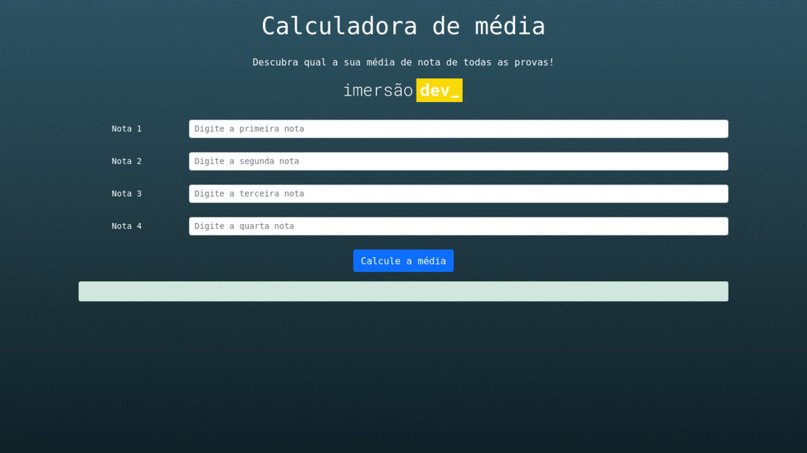

<h1 align="center"> Day 01 - Variáveis, operações e média </h1>
<h4 align="center"> 
	Status do Projeto: Concluido :heavy_check_mark:
</h4>
 

Calculadora de médias, utilizando váriaveis e operações. 

<h2 align="center"> Funcionalidades </h2>

- [X] Mostrar a média na tela;
- [X] Mostrar aprovação ou reprovação do aluno;
- [X] Mudança da cor do fundo de tela;

 
<h2 align="center"> Em caso de aprovação </h2>

  

<h2 align="center"> Em caso de Reprovação </h2>

  

