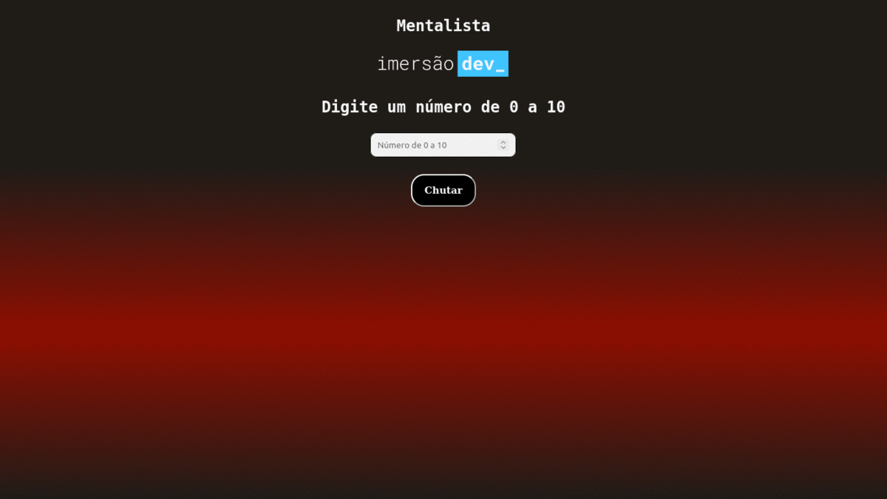

<h1 align="center"> Day 03</h1>
<h4 align="center"> 
	Status do Projeto: Concluido :heavy_check_mark:
</h4>
 

<h1 align="center">Mentalista </h1>
<h2 align="center"> Funcionalidades </h2>

- [X] Criar a lógica por trás do "chute" com if, else if e else;
- [X] Utilizar função random para gerar números aleatórios;
- [X] Adicionar um número de tentativas para a pessoa tentar acertar e imprimir a resposta no final;
- [X] Quando a pessoa errar, deixar na mensagem se o número chutado é maior ou menor que o número secreto;

 
<h2 align="center"> Código em execução </h2>

Na primeira execução conseguimos acertar o número. Na segunda execução esgotamos o número de tentativas e o jogo reinicia.

  

