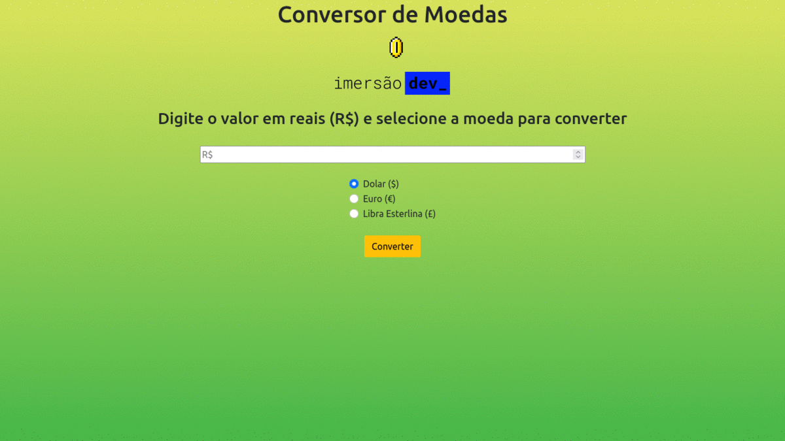

<h1 align="center"> Day 02</h1>
<h4 align="center"> 
	Status do Projeto: Concluido :heavy_check_mark:
</h4>
 

Conversor de Moedas 

<h2 align="center"> Funcionalidades </h2>

- [X] Interagir com usuário para receber os preços a serem convertidos;
- [X] Criar a lógica para saber como converter;
- [X] Adicionar outras moedas para converter;
- [X] Utilizar funções que interagem com a tela;;

 
<h2 align="center"> Código em execução </h2>

  

